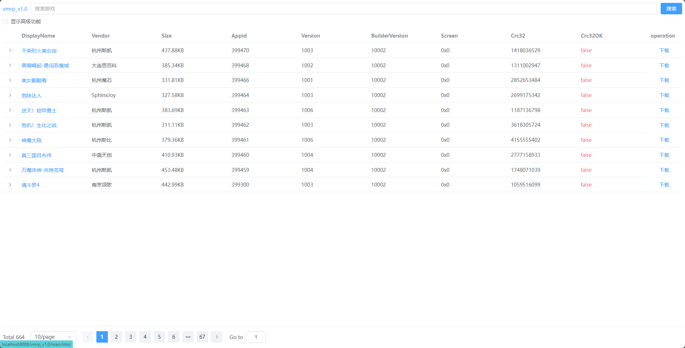

# vmrp games

## 预览




## 在线体验

1. [https://xclhove.github.io/vmrp.github.io/](https://xclhove.github.io/vmrp.github.io/)

## docker 部署

1. command
```shell
docker run -d \
  --name vmrp \
  -p 8008:80 \
  ghcr.io/xclhove/vmrp:latest
```
2. docker-compose
```yaml
version: '3'
services:
 vmrp:
  image: ghcr.io/xclhove/vmrp:latest
  container_name: vmrp
  restart: always
  ports:
   - "8008:80"
  ```